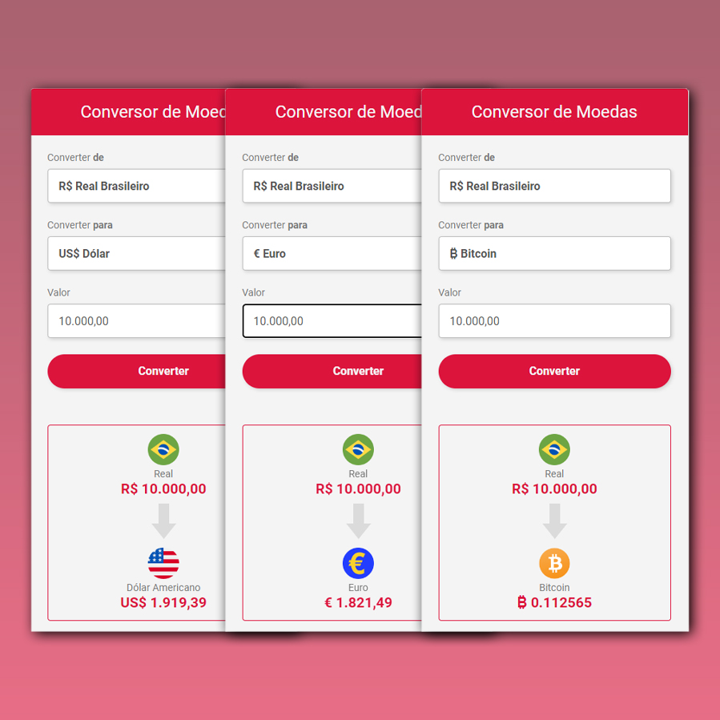

<h1 align="center"> Conversor de Moedas </h1>

Conversor de Real para Dólar, Euro, Bitcoin e Ethereum.

  <a href="#-tecnologias">Tecnologias</a>&nbsp;&nbsp;&nbsp;|&nbsp;&nbsp;&nbsp;
  <a href="#-projeto">Projeto</a>&nbsp;&nbsp;&nbsp;|&nbsp;&nbsp;&nbsp;
  <a href="#-layout">Layout</a>&nbsp;&nbsp;&nbsp;|&nbsp;&nbsp;&nbsp;
  <a href="#memo-licença">Licença</a>

  

 

  

## 🚀 Tecnologias

Esse projeto foi desenvolvido com as seguintes tecnologias:

- HTML e CSS
- JavaScript
- Git e GitHub

## 💻 Projeto

O Conversor de Moedas é um projeto que mostra a conversão da Moeda Real (R$) para 4 opções, como Dólar Americano (US$), Euro (EUR), Bitcoin (BTC) e Ethereum (ETH). Onde utilizamos o HTML como base, CSS para dar o visual e o JavaScript para deixar o projeto dinâmico e com o uso da API da [Brapi] (https://brapi.dev/) para pegar os valores atualizados, tal como utilizar o Select para fazer todas as alterações como bandeira, nome da moeda e o cálculo de acordo com a moeda escolhida. Utilizamos também o addEventListener para obter as ações do botão e do select. 

## 🔖 Layout

Você pode visualizar o layout do projeto através [DESSE LINK](https://www.figma.com/file/eg239o5MNJCj9asPPwzkrQ/CodeClub-Convert-Money?node-id=25%3A104&_gl=1*sf9rv7*_ga*NDI2MzU2NzMuMTY2ODM5MTg3Ng..*_ga_37GXT4VGQK*MTY3MDExMzM2OS40OS4xLjE2NzAxMTMzNzQuMC4wLjA.). É necessário ter conta no [Figma](https://figma.com) para acessá-lo.

## :memo: Licença

Esse projeto está sob a licença MIT.

---

Feito com ♥ by Mateus Santos, com ajuda do :wave: [DEVCLUB](https://rodolfomori.com.br/front-end/)
